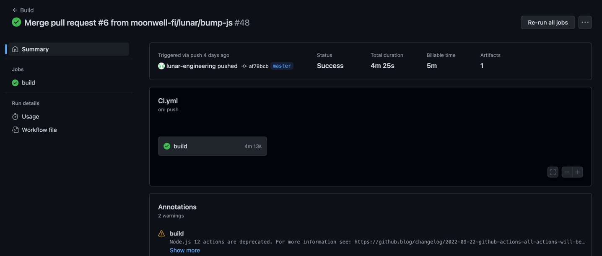
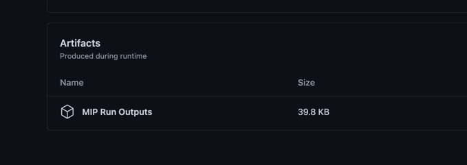

<div align="center">
<p>
    <a href="https://moonwell.fi" target="_blank">
      
    </a>
</p>
<p style="font-size: 1.5rem; font-weight: bold">Moonwell Proposal Verifications</p>
</div>

📜✅ **Moonwell Proposal Verification** is a testing suite for on-chain governance proposals within the Moonwell ecosystem. 

It utilizes `ganache` to create a forked simulator of Moonriver or Moonbeam at a given block, then has a suite of tooling to assert protocol state, pass governance proposals, and ultimately give better confidence that a submitted proposal operates as expected.  

# Installation/Usage

To get started writing a new MIP test/verification, you can just clone the repo, install the dependencies, and get working!

```shell
$ git clone git@github.com:moonwell-fi/proposal-verification.git
$ cd proposal-verification
$ npm i
```

Also ensure you have `ganache` installed globally and `ganache-cli` is accessible somewhere in your `PATH`

```shell
$ npm install -g ganache
$ ganache-cli --version
ganache v7.5.0 (@ganache/cli: 0.6.0, @ganache/core: 0.6.0)
```

# Running the verification suite

This framework utilizes `Jest` under the hood, so if you want to run the whole suite you can do:

```shell
$ npm run test
```

Or to run a specific test (for development, for example) you can just use `npx jest`

```shell
$ npx jest ./test/some-folder/
```

# Running via CI

GitHub actions is configured to run the entire suite as part of each pull request/push targeting master (you can see the config here - [.github/workflows/CI.yml](.github/workflows/CI.yml)). Along with that, it's also configured to block pull requests that have failing tests, so anything in the `master` branch should always be passing.

When triggered, the GitHub actions environment will ensure that all the tests in the suite pass, and also generate outputs (including proposal JSON that can be used in the moonwell governance portal frontend) and bundle them for download on every build.

Taking https://github.com/moonwell-fi/proposal-verification/actions/runs/3440621961 as an example,



Scrolling down to the bottom, you can see and download the built artifacts ("artifacts" here are an output of all individual tests run, including proposal JSON). If you click on `MIP Run Outputs` you'll be able to download all outputs for all tests.




# Development

The only requirement for a new test to get picked up and run as part of the overall suite is that it lives somewhere in `test/` and has a name `*-verification.ts`. 

It's usually best to keep the test straight forward and push constants or other pieces of logic to other files in the folder. 

For example, take a look at `test/mip-5`:

```shell
$ tree test/mip-5/
test/mip-5/
|-- assertCurrentExpectedState.ts
|-- assertExpectedEndState.ts
|-- generateProposalData.ts
|-- mip-5-verification.ts
`-- vars.ts
```

- `mip-5-verification.ts` is the entry point for the test
- `assertCurrentExpectedState` is all the logic to verify the *current* state of the market 
- `generateProposalData` does the work of actually creating the proposal to be submitted
- `assertExpectedEndState` does the work of validating that things are in an expected end state after the proposal has passed

This is a recommended pattern to follow, but not enforced - the goal should be readability and safety over basically anything else given the role this testing suite plays in on-chain governance safety.
